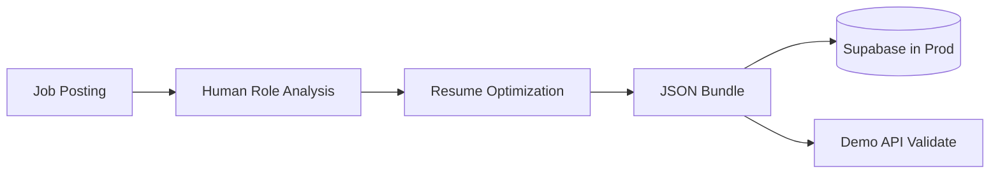

# SmartApply Architecture (Public Demo)

## What This Is

A sanitized, portfolio-friendly showcase of how I design and implement a human-in-the-loop, vocabulary-aware job search backend. This demonstrates production-ready architecture patterns and PM execution skills without exposing proprietary algorithms.

## Architecture Highlights

- **Human-in-the-Loop Design**: System where humans provide analysis through structured API endpoints
- **Production Database Schema**: 19-table PostgreSQL schema with UUIDs, RLS policies, and strategic indexes
- **Vocabulary Translation Framework**: Service architecture for company-specific term mapping
- **Resume Delta System**: Granular tracking of resume optimizations with validation guardrails
- **Observability**: Built-in logging, metrics, and audit trails

## What's Included

✅ **Production-style schema** (UUIDs, RLS, indexes)  
✅ **Service skeletons** (translator/observability/delta)  
✅ **Synthetic demo data + notebook**  
✅ **API stubs** for validating the human JSON bundle  
✅ **Architecture documentation** with system diagrams  

## What's Excluded (On Purpose)

❌ Proprietary vocabulary mappings  
❌ Real resumes and case studies  
❌ Actual concept correlations  
❌ Claude/LLM logic  
❌ Private integrations  
❌ Production API keys  

## How to Run

```bash
# Install dependencies
pip install fastapi uvicorn jupyter

# Run the API demo
uvicorn app.main:app --reload

# Open demo notebook
jupyter notebook demo/matching_demo.ipynb
```

The API will be available at `http://localhost:8000` with interactive docs at `/docs`.

## System Overview



## Key Components

### Database Schema (`sql/schema.sql`)
- 19 tables with UUID primary keys
- Row Level Security (RLS) policies
- Strategic indexes for performance
- Audit trails and timestamps

### Human-in-the-Loop API
- Role analysis validation
- Resume optimization tracking
- Translation event logging
- Anti-fabrication guardrails

### Service Architecture
- **TranslatorService**: Vocabulary mapping (stubbed)
- **ObservabilityService**: Logging and metrics
- **ResumeDeltaService**: Resume change validation

## Why This Matters

As a PM who builds, this showcases:
- **Systems thinking**: Comprehensive data modeling and service design
- **Production readiness**: Schema design, validation, observability
- **Human-centered design**: API that works with human analysts
- **Security awareness**: RLS policies, input validation, audit trails

## Roadmap Ideas

- LLM fallback integration
- Predictive scoring algorithms  
- Enterprise hiring insights
- Multi-tenant architecture

## Portfolio Context

This is a **sanitized showcase** of architecture and execution patterns. The full system includes proprietary vocabulary engines, real job data processing, and advanced ML pipelines that aren't included here for competitive reasons.

---

*Built with FastAPI, PostgreSQL, and Python. Designed for scale and maintainability.*