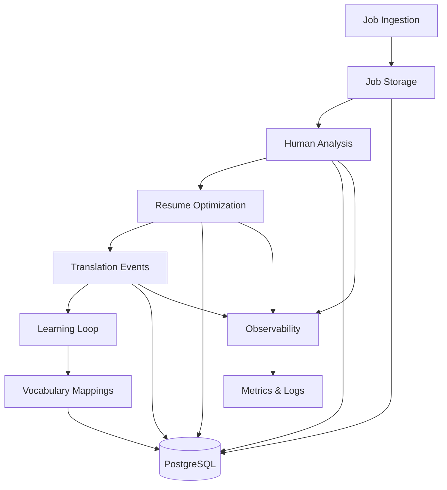

# SmartApply Architecture Documentation

## Overview

SmartApply is a human-in-the-loop job application system that combines structured data modeling with intelligent vocabulary translation. The system enables human analysts to efficiently process job postings through validated API endpoints while maintaining comprehensive audit trails.

## System Architecture

### Core Components



### Database Schema Highlights

#### 19-Table Production Schema

**Core Entities:**
- `users` - User accounts with RLS policies
- `companies` - Company profiles with worldview tagging  
- `concepts` - Normalized skill/requirement concepts
- `job_postings` - Job data with full-text descriptions

**Analysis & Optimization:**
- `role_analyses` - Human job analysis with scoring
- `resume_optimizations` - Resume modifications tracking
- `resume_deltas` - Granular bullet-point changes
- `master_bullets` - Reusable resume components

**Learning System:**
- `concept_mappings` - Term-to-concept translations
- `translation_events` - Learning event audit trail
- `company_term_styles` - Company-specific vocabulary

**Observability:**
- `ingest_runs` - Job discovery metrics
- `api_calls` - Performance and cost tracking
- `llm_cache` - LLM response caching (7-day TTL)

#### Key Schema Features

**UUID Primary Keys:**
```sql
id UUID PRIMARY KEY DEFAULT gen_random_uuid()
```

**Row Level Security:**
```sql
ALTER TABLE users ENABLE ROW LEVEL SECURITY;
CREATE POLICY user_own_data ON users FOR ALL USING (auth.uid() = id);
```

**Strategic Indexes:**
```sql
CREATE INDEX idx_concept_mappings_raw_term ON concept_mappings (lower(raw_term));
CREATE INDEX idx_job_postings_title ON job_postings (lower(title));
```

**Audit Timestamps:**
```sql
created_at TIMESTAMP WITH TIME ZONE DEFAULT NOW(),
updated_at TIMESTAMP WITH TIME ZONE DEFAULT NOW()
```

## Human-in-the-Loop Flow

### 1. Job Analysis (`POST /human/role-analysis`)

Human analysts evaluate jobs through structured input:

```json
{
  "job_posting_id": "uuid",
  "overall_fit_score": 85,
  "fit_reasoning": "Strong platform alignment...",
  "key_matches": {
    "platform": "6+ years platform experience",
    "api_design": "Extensive API development background"
  },
  "vocabulary_gaps": {
    "SDK": "Need to emphasize integration work"
  },
  "optimization_strategy": "Emphasize developer-facing work",
  "confidence_level": 8,
  "estimated_application_priority": "high"
}
```

### 2. Resume Optimization (`POST /human/resume-optimization`)

Granular resume modifications with validation:

```json
{
  "role_analysis_id": "uuid",
  "resume_deltas": [
    {
      "master_bullet_id": "uuid", 
      "operation": "rephrase",
      "from_text": "Built platform tools",
      "to_text": "Developed developer platform SDK",
      "concept_ids": ["platform_uuid", "sdk_uuid"]
    }
  ],
  "optimization_reasoning": "Emphasizing SDK work for developer tools role"
}
```

### 3. Translation Events (`POST /human/translation-event`)

Learning from human vocabulary decisions:

```json
{
  "role_analysis_id": "uuid",
  "original_terms": ["platform", "tooling"],
  "translated_terms": ["SDK", "developer experience"],
  "processing_time_ms": 1200
}
```

## Service Architecture

### TranslatorService

**Purpose**: Company-specific vocabulary mapping

**Key Methods:**
- `translate_term(term, company)` - Single term translation
- `batch_translate_with_confidence()` - Bulk translation with scores
- `learn_from_feedback()` - Update mappings from human input

**Demo Implementation**: Simple lookup table (production uses ML models)

### ObservabilityService

**Purpose**: Comprehensive system monitoring

**Features:**
- Structured logging with context
- Performance timing decorators  
- API call cost tracking
- Business metric collection
- Health status aggregation

**Metrics Types:**
- Counters (API calls, jobs processed)
- Gauges (active users, system load)
- Histograms (response times, scores)
- Timers (operation durations)

### ResumeDeltaService

**Purpose**: Resume modification validation

**Anti-Fabrication Checks:**
- New metrics/numbers detection
- Technical skill addition monitoring
- Content similarity scoring
- Operation constraint enforcement

**Allowed Operations:**
- `rephrase` - Rewrite bullet content  
- `reorder` - Change bullet sequence
- `emphasize` - Add formatting/emphasis
- `omit` - Remove bullets entirely

## Validation & Security

### Data Validation

**Resume Delta Validation:**
- Operation must be in allowed set
- No new metrics can be added
- Technical skills additions flagged
- Excessive text expansion detected

**API Input Validation:**
- UUID format checking
- Score range enforcement (0-100)
- Required field validation
- Business rule compliance

### Security Features

**Row Level Security:**
- Users can only access their own data
- Company-specific data isolation
- Role-based access patterns

**Audit Trails:**
- All modifications tracked with timestamps
- User attribution on all changes
- Full operation history maintained

## Scalability & Performance

### Database Optimization

**Strategic Indexing:**
- Lowercase text indexes for case-insensitive search
- Composite indexes on frequently joined columns
- Partial indexes on filtered queries

**Query Optimization:**
- Prepared statement usage
- Connection pooling
- Query result caching

### Observability at Scale

**Metrics Collection:**
- Async metric recording
- Batch metric exports
- Configurable sampling rates

**Performance Monitoring:**
- API endpoint timing
- Database query performance  
- External service latencies

## Production Considerations

### Data Privacy

**Sanitization Requirements:**
- No real resume content in public repos
- API keys and secrets externalized
- User PII scrubbing in logs

### Deployment Architecture

**Service Boundaries:**
- Separate API and background processing
- Database connection pooling
- External service isolation

**Monitoring & Alerting:**
- Health check endpoints
- Error rate monitoring
- Performance threshold alerts

## Demo vs Production

### What's Included (Demo)
- Complete database schema
- Service architecture patterns
- API endpoint shapes  
- Validation logic
- Observability framework

### What's Excluded (Production)
- Proprietary ML models
- Real vocabulary mappings
- LLM integration logic
- Company-specific algorithms
- Production API keys

---

*This architecture supports both human-driven analysis and future ML augmentation while maintaining data integrity and comprehensive audit trails.*